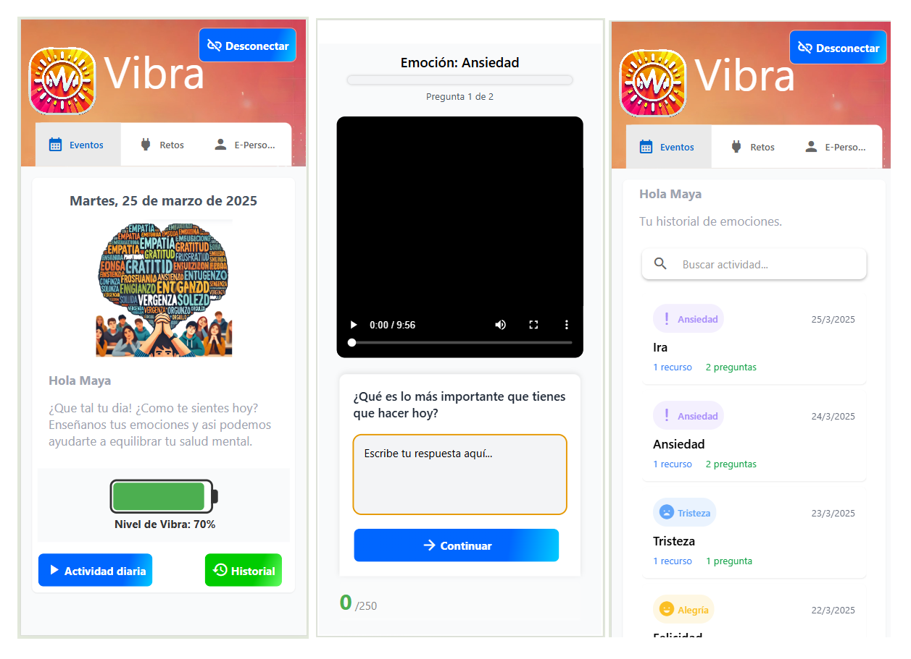

# Getting Started with this vibra-api

This Web Mobile offers Vibra generation

## Preview



========================================================================

_vibra.cds.net.co_

## Technologies

Web mobile - React-Native, Tailwind,  expo

## Other settings in the project

|    <!-- -->    |  <!--   -->   |    <!-- -->    |
|  :----------:  |  :---------:  | :------------: |
|   _Tsconfig_   |  _Prettier_   | _Jsonwebtoken_ |
|    _Eslint_    |     _Ejs_     |     _Expo_     |
|     _Git_      | _react-query_ |    _moment_    |
|  _ReactNative_ |    _React_    |   _Zustand_    |
|     _Axios_    |  _socket-io_  |  _Typescript_  |

## Starting 🚀

_These instructions will allow you to get a copy of the project running on the local machine for development and testing purposes._

See **Deployment** to learn how to deploy the project.

### Pre- requirements 📋

- _NodeJS_ current version v20.13.1

##### Recommended 📋

- _Trae_
- _Warp_
- _Google Chrome_
- _GitHub Desktop_
- _Android Studio Emulator Device_

### Installation 🔧

**To install the project locally and run the api please execute the following steps**

_Clone the vibra-web-mb repository from github_

```
git clone https://github.com/Guarnizo2023/vibra-web-mb.git
```

_Install the dependencies_

```
npm i
```

_Compile the project and start the app_

```
npm run start
```

_Invoke the screen main_

```
http://localhost:8081/
```

## Built with 🛠️

_Tools and Technologies used_

- [NodeJS](https://nodejs.org/en/) - Server-side JavaScript environment,uses an asynchronous and event-driven model
- [React-Native](https://reactnative.dev/) - Fast, unopinionated, mobile web framework
- [Npm](https://www.npmjs.com/) - Dependency manager
- [Expo](https://www.expo.com/) - Create universal native apps with React that run on Android, iOS, and the web. Iterate with confidence.

## Contributing 🖇️

Contributions are currently not allowed.

## Versioned 📌

[SemVer](http://semver.org/) is used for versioning. For all versions available.

## Authors ✒️

_Built by_

- **Ermes Guarnizo Motta** - _Engineer System Teacher UNAD_ - [Guarnizo2023](https://github.com/Guarnizo2023)
- **Yovany Suárez Silva** - _Full Stack Software Engineer_ - [desobsesor](https://github.com/desobsesor)

## License 📄

This project is under the MIT License - see the file [LICENSE.md](LICENSE.md) for details

## Expressions of Gratitude 🎁

⌨️ With ❤️ for the educational community.
